# 🛰️ تمارین شبکه‌های بی‌سیم / Wireless Networking Labs
<div align="center">


</div>

## 🌍 زبان / Language
[فارسی](#فارسی) / [English](#english)

<div id="فارسی" dir="rtl">

## 📚 فارسی
**مجموعه‌ای از تمرین‌های عملی شبکه‌های بی‌سیم با استفاده از Cisco Packet Tracer**  
این ریپازیتوری شامل پیاده‌سازی توپولوژی‌های مختلف شبکه‌ای مطابق با سرفصل‌های درس مبانی شبکه‌های بی‌سیم می‌باشد.

### 🧩 فهرست تمرین‌ها
<div align="center"> 

| لینک                     | وضعیت         | عنوان تمرین                  | شماره تمرین |  
|--------------------------|---------------|-----------------------------|-------------|  
| [مشاهده](#تمرین-۱)      | ✅ تکمیل‌شده   | ساخت توپولوژی پایه          | ۱           |  
| [مشاهده](#تمرین-۲)      | ✅ تکمیل‌شده   | راه‌اندازی DHCP             | ۲           |  
| [مشاهده](#تمرین-۱-۲)    | ✅ تکمیل‌شده   | تمرین اضافی                | ۱-۲         |  
| [مشاهده](#تمرین-۳)      | ✅ تکمیل‌شده   | کارکردن با وب سرور                | ۳           |  
| [مشاهده](#تمرین-۴)      | ✅ تکمیل‌شده   | کارکردن با Sniffer               | ۴           |  

</div>

---
<details id="تمرین-۱">
<summary> 📌 تمرین ۱: ساخت توپولوژی پایه </summary>

<div dir="rtl">

<div align="right">

#### 🌟 هدف تمرین
پیاده‌سازی یک شبکه محلی ساده با قابلیت ارتباط بین دستگاه‌ها در لایه ۲.

#### 🛠️ تجهیزات مورد نیاز
- ۱ عدد سوئیچ Cisco 2960
- ۳ عدد کامپیوتر (PC)
- کابل Cross-Over

#### 📝 مراحل اجرا
1. افزودن سوئیچ و سه PC به محیط
2. اتصال دستگاه‌ها با کابل Straight-Through
3. تنظیم آدرس IP:

<div align="left">

```code
   - PC0: 192.168.1.1/24
   - PC1: 192.168.1.2/24
   - PC2: 192.168.1.3/24
```
</div>

4. تست ارتباط با دستور ping

</div>

#### 🎨 دیاگرام توپولوژی
<div align="center"> 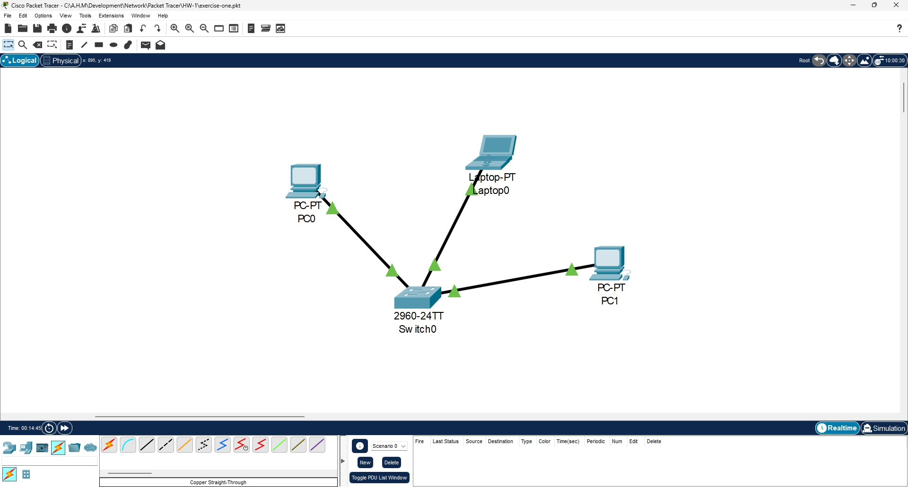 </div>

#### 🧪 خروجی تست
<div align="center"> 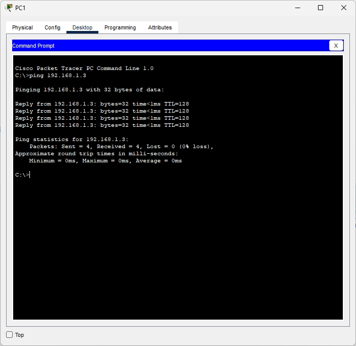 </div>

</details>

<details id="تمرین-۲">
<summary> 📌 تمرین ۲: راه اندازی DHCP </summary>

<div dir="rtl">

<div align="right">

#### 🌟 هدف تمرین
پیاده سازی یک شبکه همراه با راه اندازی DHCP Server.

#### 🛠️ تجهیزات مورد نیاز
- ۱ عدد سوئیچ Cisco 2960
- ۳ عدد کامپیوتر (PC)
- 1 عدد سرور (server)
- کابل Cross-Over

#### 📝 مراحل اجرا
1. افزودن سوئیچ و سرور و سه PC به محیط
2. اتصال دستگاه‌ها با کابل Cross-Over
3. پس از رفتن به تب config
 - تنظیم آدرس IP سرور:
   + Server: 192.168.1.1/24
 - تنظیم DNS سرور:
   + Server: 1.1.1.1
 - تنظیم Default Gateway:
   + Server: 192.168.1.1
4. پس از رفتن به تب service و بخش DHCP:
 - وارد کردن اطلاعات DNS, Default Gateway
   + تنظیم رنج IP شروع و تعداد کاربران
5. رفتن به تب Desktop, IP Configuration برای هر کامپیوتر و انتخاب گزینه DHCP

</div>

#### 🎨 دیاگرام توپولوژی
<div align="center"> 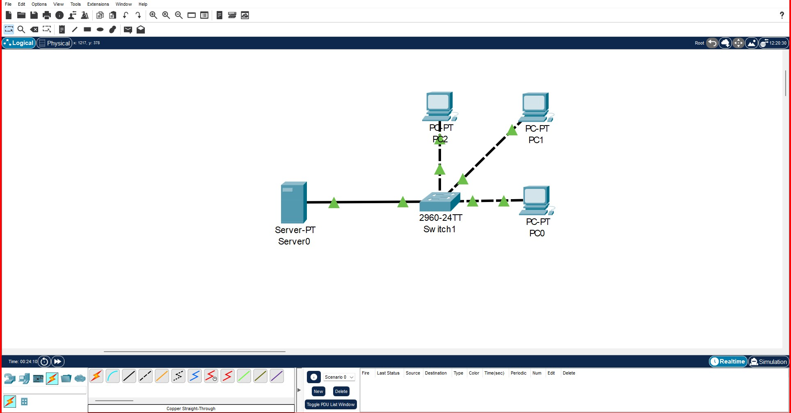 </div>

#### 🧪 خروجی تست
<div align="center"> 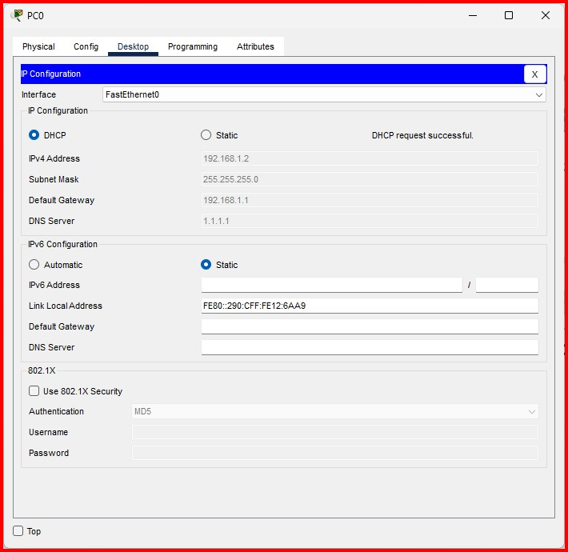 </div>
<div align="center"> 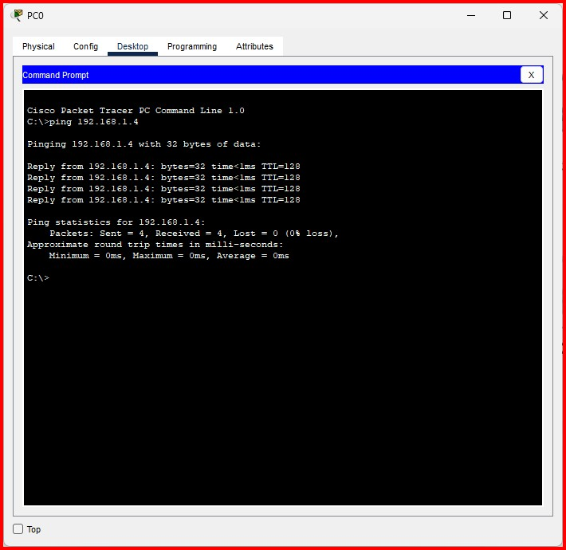 </div>

</details>

<details id="تمرین-۲">
<summary> 📌 تمرین ۲ اضافی: راه اندازی VLAN </summary>

<div dir="rtl">

<div align="right">

#### 🌟 هدف تمرین
ایجاد شبکه‌های مجازی (VLAN) برای تفکیک. ترافیک پیاده‌سازی Router-on-a-Stick برای ارتباط بین VLANها

#### 🛠️ تجهیزات مورد نیاز
- ۱ عدد سوئیچ Cisco 2960
- ۴ عدد کامپیوتر (PC)
- ۱ عدد روتر Cisco 1941
- کابل Cross-Over

#### 📝 مراحل اجرا

## گام اول:
<div align="left">

```code
Switch> enable
Switch# configure terminal

! ایجاد VLANها
Switch(config)# vlan 10
Switch(config-vlan)# name Sales
Switch(config-vlan)# exit

Switch(config)# vlan 20
Switch(config-vlan)# name Marketing
Switch(config-vlan)# exit

! اختصاص پورت‌ها به VLANها
Switch(config)# interface range fa0/1-2
Switch(config-if-range)# switchport mode access
Switch(config-if-range)# switchport access vlan 10
Switch(config-if-range)# exit

Switch(config)# interface range fa0/3-4
Switch(config-if-range)# switchport mode access
Switch(config-if-range)# switchport access vlan 20
Switch(config-if-range)# exit

! پیکربندی Trunk Port
Switch(config)# interface gig0/1
Switch(config-if)# switchport mode trunk
Switch(config-if)# switchport trunk allowed vlan 10,20
```
</div>

## گام دوم:
<div align="left">

```code
Router> enable
Router# configure terminal

! ایجاد Subinterfaces
Router(config)# interface gig0/0.10
Router(config-subif)# encapsulation dot1Q 10
Router(config-subif)# ip address 192.168.10.1 255.255.255.0

Router(config-subif)# interface gig0/0.20
Router(config-subif)# encapsulation dot1Q 20
Router(config-subif)# ip address 192.168.20.1 255.255.255.0

! فعال‌سازی رابط اصلی
Router(config)# interface gig0/0
Router(config-if)# no shutdown
```
</div>

## گام سوم:
<div align="center">

| Default Gateway                     |IP Address        | VLAN                 | دستگاه|  
|--------------------------|---------------|-----------------------------|-------------|  
| 192.168.10.1     | 192.168.10.10  | 10         | PC0          |  
| 192.168.10.1     | 192.168.10.11  | 10             | PC1           |  
| 192.168.20.1    | 192.168.20.10  | 20               | PC2         |  
| 192.168.20.1     | 192.168.20.11  | 20               | PC3           |  

</div>
</div>

#### 🎨 دیاگرام توپولوژی
<div align="center"> 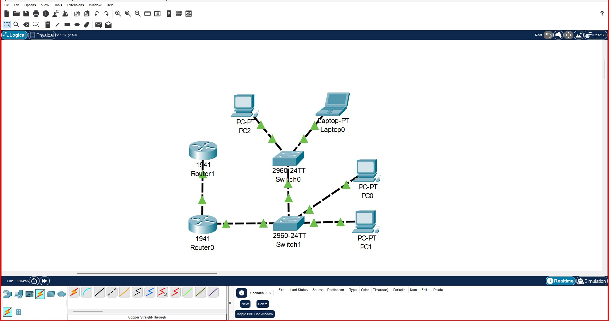 </div>

#### 🧪 خروجی تست
<div align="center"> 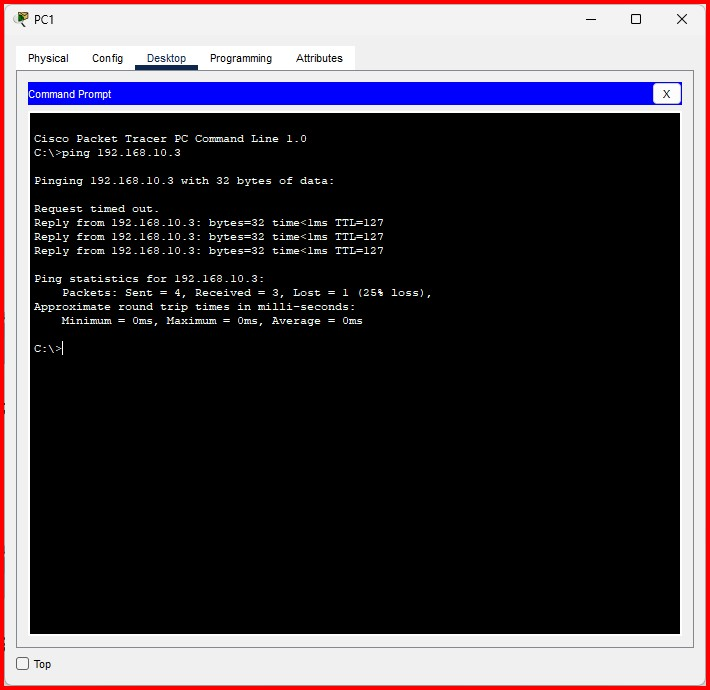 </div>

</details>

<details id="تمرین-۳">
<summary> 📌 تمرین ۳: کارکردن با وب سرور </summary>

<div dir="rtl">

<div align="right">

#### 🌟 هدف تمرین
پیاده‌سازی یک وب سرور برای مخابره پیام "Hello World From A.H.M".

#### 🛠️ تجهیزات مورد نیاز
- ۱ عدد سوئیچ Cisco 2960
- ۱ عدد کامپیوتر (PC)
- ۱ عدد سرور (Server)
- کابل Straight-Through

#### 📝 مراحل اجرا
1. افزودن سوئیچ و PC و سرور به محیط
2. اتصال دستگاه‌ها با کابل Straight-Through
3. تنظیم آدرس IP:
   - Server: 192.168.1.1/24
   - سپس تغییر index.html موجود در تب Services/HTTP
4. تست عملکرد با رفتن به تب Desktop/Web Browser و جستجوی IP سرور

</div>

#### 🎨 دیاگرام توپولوژی
<div align="center"> 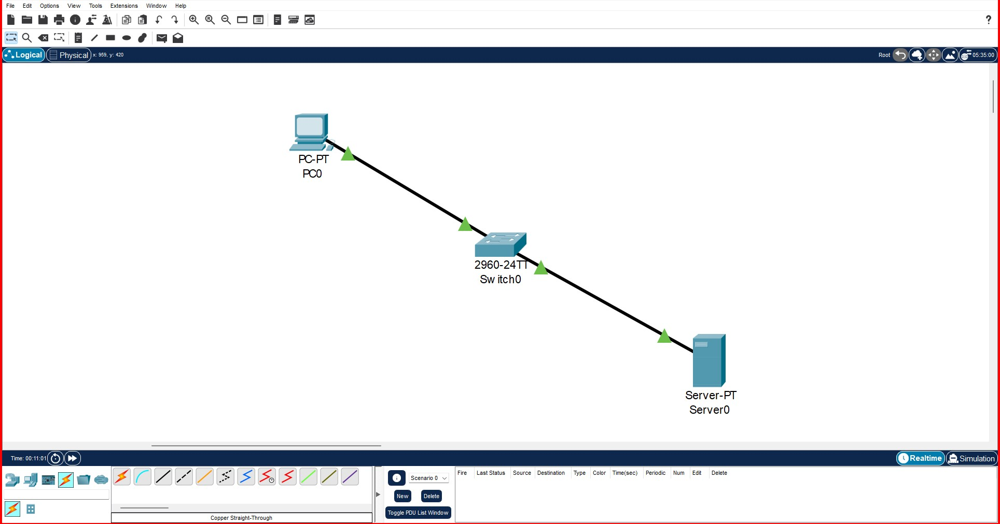 </div>

#### 🧪 خروجی تست
<div align="center"> 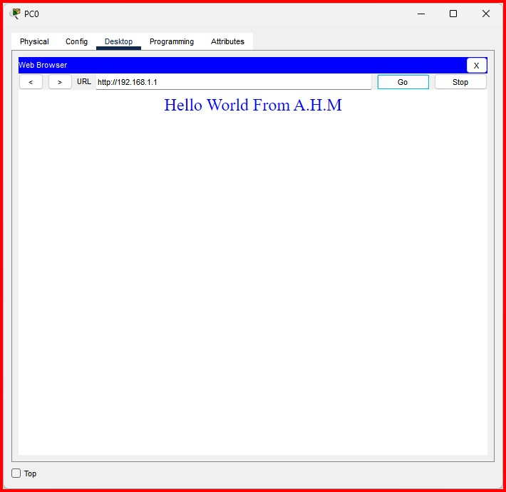 </div>

</details>

<details id="تمرین-۴">
<summary> 📌 تمرین ۴: کارکردن با Sniffer </summary>

<div dir="rtl">

<div align="right">

#### 🌟 هدف تمرین
Sniff کردن بسته های مخابره شده میان کاربر، سوئیچ و سرور است.

#### 🛠️ تجهیزات مورد نیاز
- ۱ عدد سوئیچ Cisco 2960
- ۱ عدد کامپیوتر (PC)
- ۱ عدد سرور (Server)
- ۱ عدد اسنیفر (Sniffer)
- کابل Straight-Through

#### 📝 مراحل اجرا
1. مطابق تمرین گذشته عمل کرده و سپس پس از اتمام مراحل تمرین قبلی ادامه می دهیم.
2. اتصال دستگاه اسنیفر با کابل Straight-Through به سوئیچ
3. اجرای دستورات زیر بر روی سوئیچ:

<div align="left">

```code
Switch> enable
Switch# configure terminal
Switch(config)# monitor session 1 source vlan 1 both
Switch(config)# monitor session 1 destination interface fastethernet0/1
Switch# show monitor session 1
```
</div>

4. تست عملکرد با رفتن به تب Desktop/Command Prompt و اجرای دستورات telnet, ping و یا جستجوی IP سرور در Web Browser
- توضیحات: این تنظیمات ترافیک تمام vlan 1 را capture کرده و به مقصد اسنیفر ارسال میکند.
- توجه: در این تمرین تنها بسته های مشخصی جهت Sniff شدن انتخاب شده اند.

</div>

#### 🎨 دیاگرام توپولوژی
<div align="center"> 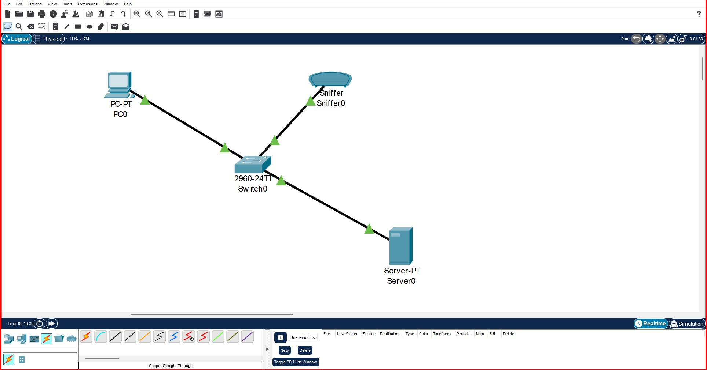 </div>

#### 🧪 خروجی تست
<div align="center"> 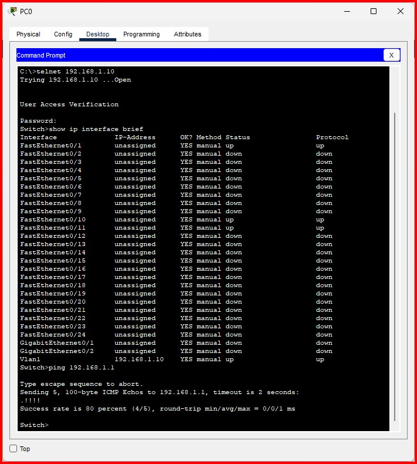 </div>
<div align="center"> 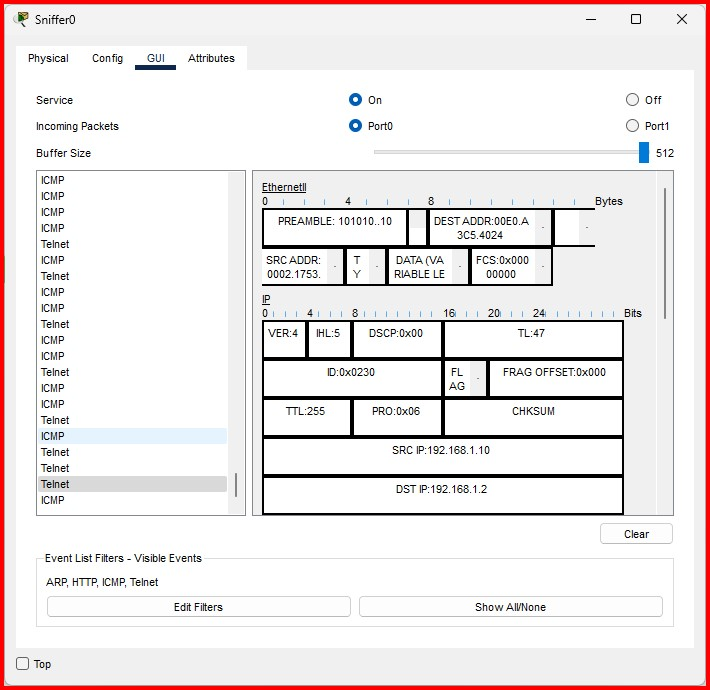 </div>

</details>

</div>


<div id="english" dir="ltr">

## 🌍 English

**Hands-on Wireless Networking Labs using Cisco Packet Tracer**  
This repository contains implementations of various network topologies aligned with wireless networking fundamentals.

### 🧩 Exercise Catalog  
<div align="center"> 

| Exercise # | Title                     | Status        | Link  |  
|------------|---------------------------|---------------|-------|  
| 1          | Basic Layer 2 Topology     | ✅ Completed  | [View](#exercise-1)  |  
| 2          | Implement DHCP     | ✅ Completed  | [View](#exercise-2)  |  
| 2-1          | Extra Exercise     | ✅ Completed  | [View](#exercise-2-1)  |  
| 3          | Working With Web Server         | ✅ Completed | [View](#exercise-3)  | 
| 4          | Working With Sniffer         | ✅ Completed | [View](#exercise-4)  | 

</div>
  
<details id="exercise-1"> 
<summary> 📌 Exercise 1: Basic Layer 2 Topology </summary>  

#### 🌟 Objective  
Implement a simple LAN with Layer 2 connectivity between devices.

#### 🛠️ Required Equipment  
1 × Cisco 2960 Switch  
3 × PCs  
Straight-Through Cable  

#### 📝 Implementation Steps  
1. Add switch and three PCs to workspace  
2. Connect devices using Straight-Through cable  
3. Configure IP addresses:  
```code
   - PC0: 192.168.1.1/24  
   - PC1: 192.168.1.2/24  
   - PC1: 192.168.1.3/24  
```
4. Test connectivity using ping 

#### 🎨 Topology Diagram
<div align="center">  </div>

#### 🧪 Test Output
<div align="center">  </div>

</details>

<details id="exercise-2"> 
<summary> 📌 Exercise 2: Implement DHCP </summary>  

#### 🌟 Objective  
Implement a network with a DHCP Server setup.

#### 🛠️ Required Equipment  
- 1 × Cisco 2960 Switch
- 3 × PCs
- 1 × Server
- Cable: Cross-Over 

#### 📝 Implementation Steps  
1. Add switch, server, and three PCs to workspace  
2. Connect devices using Cross-Over cable  
3. In the config tab:  
   - Configure server IP: 192.168.1.1/24  
   - Set DNS: 1.1.1.1  
   - Set Default Gateway: 192.168.1.1  
4. In the service tab, under DHCP:  
   - Enter DNS and Default Gateway  
   - Set starting IP range and number of clients  
5. Go to Desktop > IP Configuration on each PC and select DHCP

#### 🎨 Topology Diagram
<div align="center">  </div>

#### 🧪 Test Output
<div align="center">  </div>
<div align="center">  </div>

</details>

<details id="exercise-2-1"> 
<summary> 📌 Exercise 2 Extra: Extra Exercise </summary>  

#### 🌟 Objective  
Implement a network with a DHCP Server setup.

#### 🛠️ Required Equipment  
- 1 × Cisco 2960 Switch
- 3 × PCs
- 1 × Server
- Cable: Cross-Over 

#### 📝 Implementation Steps  
1. Add switch, server, and three PCs to workspace  
2. Connect devices using Cross-Over cable  
3. In the config tab:  
   - Configure server IP: 192.168.1.1/24  
   - Set DNS: 1.1.1.1  
   - Set Default Gateway: 192.168.1.1  
4. In the service tab, under DHCP:  
   - Enter DNS and Default Gateway  
   - Set starting IP range and number of clients  
5. Go to Desktop > IP Configuration on each PC and select DHCP

#### 🎨 Topology Diagram
<div align="center">  </div>

#### 🧪 Test Output
<div align="center">  </div>
<div align="center">  </div>

</details>

<details id="exercise-3"> 
<summary> 📌 Exercise 3: Working With Web Server </summary>  

#### 🌟 Objective  
Configure and test a basic web server environment.

#### 🛠️ Required Equipment  
- 1 × Cisco 2960 Switch
- 1 × PC
- 1 × Web Server
- Cable: Straight-Through

#### 📝 Implementation Steps  
1. Add the switch, web server, and a client PC to the workspace.  
2. Connect devices using appropriate cables.  
3. Configure IP addresses:  
   - Web Server: 192.168.2.1/24  
   - Client PC: 192.168.2.2/24  
4. Configure web server settings (enable HTTP service) on the server.  
5. Test connectivity by accessing the web server from the client PC.

#### 🎨 Topology Diagram
<div align="center">  </div>

#### 🧪 Test Output
<div align="center">  </div>

</details>

<details id="exercise-4">
<summary> 📌 Exercise 4: Working with Sniffer </summary>

<div dir="ltr">

<div align="left">

#### 🌟 Exercise Objective
To sniff the packets exchanged between the user, switch, and server.

#### 🛠️ Required Equipment
- 1 Cisco 2960 Switch
- 1 PC
- 1 Server
- 1 Sniffer
- Straight-Through Cable

#### 📝 Steps
1. Follow the previous exercise and then continue after completing its steps.
2. Connect the Sniffer device to the switch using a Straight-Through cable.
3. Execute the following commands on the switch:
```code
Switch> enable
Switch# configure terminal
Switch(config)# monitor session 1 source vlan 1 both
Switch(config)# monitor session 1 destination interface fastethernet0/1
Switch# show monitor session 1
```
4. Test functionality by going to the Desktop/Command Prompt tab and executing commands such as telnet, ping, or browsing to the server's IP address.
- Notes: This configuration captures all traffic from VLAN 1 and sends it to the Sniffer destination.
- Note: In this exercise, only specific packets are selected for sniffing.

#### 🎨 Topology Diagram
<div align="center">  </div>

#### 🧪 Test Output
<div align="center">  </div>
<div align="center">  </div>

</div>

<h3>📬 Contact</h3>
<a href="mailto:mr.amirhosseinmaleki@gmail.com">  </a>